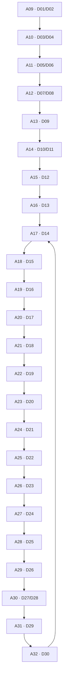

# Visaxa Research Editorial Roadmap

## Document role

This is the canonical operational roadmap for the Research publication pipeline:

`Decision → Design → Draft → Evidence → Publication Candidate → Published → Observation`

It tracks work against the canonical IDs and relationships in the Decision Framework SOT and Human Decision Graph. It does not redefine Decision IDs, Article IDs, article ownership, concepts, evidence types or logical dependencies. If this roadmap conflicts with the SOT or a canonical graph, the SOT and graph govern architecture and this roadmap must be corrected.

## Status and evidence vocabulary

### Editorial status

- `PLANNED` — canonical article exists, but no current design work is recorded.
- `DESIGN` — article design is complete or actively maintained; drafting has not been approved.
- `EVIDENCE` — evidence collection or review is the active stage.
- `DRAFT` — a draft exists, but it has not reached publication-candidate status.
- `PUBLICATION CANDIDATE` — evidence-bounded draft is ready for final validation.
- `PUBLISHED` — article is live; no canonical observation program is active.
- `OBSERVATION` — article is published and has an active observation record.
- `STABLE` — article has passed its defined observation period and no active review trigger exists.
- `REVIEW REQUIRED` — progression or continued reliance is blocked by an explicit evidence, maintenance or freshness gate.

### Evidence status

- `Evidence not started` — no complete canonical Evidence Pack is recorded. For legacy published articles, this does not mean the article contains no sources; it means the current formal evidence workflow has not been completed.
- `Evidence in progress` — a canonical evidence record exists but remains incomplete.
- `Evidence complete` — the evidence record has completed review with explicit limitations.

## Master article roadmap

Branch labels B1–B6 use the canonical branches in `human_decision_graph/06_NEXT_DECISION_BRANCHES.md`. Articles A01–A08 predate that planned sequence, so their cross-branch placement is derived only from their canonical Decision IDs; it does not add graph edges.

| Article ID | Decision ID | Working title | Branch | Current status | Evidence tracking | Priority |
| --- | --- | --- | --- | --- | --- | --- |
| A01 | D10, D15, D21 | How to Evaluate a CRM: What Actually Matters for Service Businesses | B3/B4 — existing cross-branch coverage | PUBLISHED | Evidence not started | MEDIUM |
| A02 | D01, D03, D12 | Why Scheduling Breaks in Service Businesses (and How to Fix It) | B1/B3 — existing cross-branch coverage | PUBLISHED | Evidence not started | MEDIUM |
| A03 | D12, D28 | What Actually Breaks First When a Scheduling System Scales | B3/B6 — existing cross-branch coverage | PUBLISHED | Evidence not started | MEDIUM |
| A04 | D10, D16, D17, D20, D21 | How to Choose a Salon CRM Without Regretting It Later | B3/B4 — existing cross-branch coverage | PUBLISHED | Evidence not started | MEDIUM |
| A05 | D07, D08, D24, D27 | Why Good Employees Stop Using Good Software | B2/B5/B6 — existing cross-branch coverage | PUBLISHED | Evidence not started | MEDIUM |
| A06 | D09, D22, D23 | Owner Checklist — Launching a Salon CRM | B2/B5 — existing cross-branch draft | DRAFT | Evidence not started | MEDIUM |
| A07 | D13, D25 | Financial Privacy / Safe Mode PIN — Why It Matters | B3/B5 — existing cross-branch draft | DRAFT | Evidence not started | HIGH |
| A08 | D21 | Square vs Fresha vs Mindbody — Practical Trade-offs | B4 — existing comparison draft | DRAFT | Evidence not started | LOW |
| A09 | D01, D02 | Is This a Software Problem or One Bad Incident? | B1 — Should I act, and what should change? | PLANNED | Evidence not started | LOW |
| A10 | D03, D04 | Fix the Process or Replace the Software? | B1 — Should I act, and what should change? | PLANNED | Evidence not started | LOW |
| A11 | D05, D06 | Standardize Before You Configure | B2 — Are we ready to change how the business works? | PLANNED | Evidence not started | MEDIUM |
| A12 | D07, D08 | Capture Operational Knowledge Before Automation | B2 — Are we ready to change how the business works? | PLANNED | Evidence not started | MEDIUM |
| A13 | D09 | Are You Ready to Implement New Business Software? | B2 — Are we ready to change how the business works? | PLANNED | Evidence not started | MEDIUM |
| A14 | D10, D11 | CRM, Scheduler, POS, or Connected Stack? | B3 — What must be true before I compare products? | PLANNED | Evidence not started | HIGH |
| A15 | D12 | What Can Your Business Actually Promise on the Calendar? | B3 — What must be true before I compare products? | PLANNED | Evidence not started | HIGH |
| A16 | D13 | View, Edit, Export, API: Decide Access Before Choosing Software | B3 — What must be true before I compare products? | PLANNED | Evidence not started | HIGH |
| A17 | D14 | Build the Exit Inventory Before You Buy | B3 — What must be true before I compare products? | OBSERVATION | Evidence complete | HIGH |
| A18 | D15 | What Evidence Should Make You Trust Business Software? | B4 — What evidence earns commitment? | PLANNED | Evidence not started | MEDIUM |
| A19 | D16 | What Will This Software Cost at Your Next Threshold? | B4 — What evidence earns commitment? | PLANNED | Evidence not started | MEDIUM |
| A20 | D17 | Test Adoption Before Contract Signature | B4 — What evidence earns commitment? | PLANNED | Evidence not started | MEDIUM |
| A21 | D18 | Prove the Report Before You Trust the Dashboard | B4 — What evidence earns commitment? | PLANNED | Evidence not started | MEDIUM |
| A22 | D19 | Make Vendors Demonstrate the Failure Cases | B4 — What evidence earns commitment? | PLANNED | Evidence not started | MEDIUM |
| A23 | D20 | Can You Leave the Software Later? | B4 — What evidence earns commitment? | DESIGN | Evidence not started | HIGH |
| A24 | D21 | Compare Products Only After the Decisions Are Clear | B4 — What evidence earns commitment? | REVIEW REQUIRED | Evidence not started | MEDIUM |
| A25 | D22 | A Successful Import Is Not a Successful Migration | B5 — Did implementation actually work? | PLANNED | Evidence not started | HIGH |
| A26 | D23 | Define Go-Live Acceptance Before Onboarding Ends | B5 — Did implementation actually work? | PLANNED | Evidence not started | HIGH |
| A27 | D24 | What Staff Workarounds Are Trying to Tell You | B5 — Did implementation actually work? | PLANNED | Evidence not started | HIGH |
| A28 | D25 | Test Client Continuity After a System Change | B5 — Did implementation actually work? | PLANNED | Evidence not started | HIGH |
| A29 | D26 | Monitor Operational Truth After Go-Live | B5 — Did implementation actually work? | PLANNED | Evidence not started | HIGH |
| A30 | D27, D28 | Change the Workflow, Configuration, Plan, or Platform? | B6 — Recover, scale or leave | PLANNED | Evidence not started | LOW |
| A31 | D29 | Stay, Supplement, Renegotiate, or Switch? | B6 — Recover, scale or leave | PLANNED | Evidence not started | LOW |
| A32 | D30 | When Is It Safe to Shut Down the Old System? | B6 — Recover, scale or leave | PLANNED | Evidence not started | LOW |

## Current known state

### A17

- Publication state: published.
- Editorial status: `OBSERVATION`.
- Evidence: complete, with known limitations preserved in its Evidence Pack.
- Observation: active in the canonical A17 Observation Log.
- Current action: observe; do not alter the article from one isolated observation.

### A23

- Design state: complete.
- Editorial status: `DESIGN`.
- Evidence: not started.
- Drafting/publication: blocked by the exact evidence gaps recorded in the A23 Article Design Document.
- Current action: the next permissible pipeline stage is evidence planning or evidence collection under a separate task; this roadmap does not begin it.

### Remaining library

- A01–A05 retain their current published state.
- A06–A08 retain their current draft state.
- A24 remains `REVIEW REQUIRED` because the SOT explicitly blocks product comparison until current product evidence, maintenance ownership and claim-refresh rules exist.
- All other canonical articles remain `PLANNED`.

## Canonical dependency graph

The graph below reproduces the canonical planned reading order. It is a logical decision dependency, not a claim that every reader must consume every article or that every editorial stage must wait for publication of the previous node.

### Explicit editorial stage dependencies

Only stage gates already established by the current project state are treated as hard editorial dependencies:

| Dependent work | Required predecessor stage | Current result | Basis |
| --- | --- | --- | --- |
| A23 design | A17 published | MET | A17 is the published inventory consumed by A23; the current project brief explicitly established this gate. |
| A24 design | A23 design complete | MET | A23 resolves D20 immediately before A24 resolves D21; the current project brief explicitly established this gate. |
| A24 publication candidate | Current product evidence, maintenance ownership and claim-refresh rules complete | NOT MET | Explicit SOT gate for A24 and the existing A08 comparison draft. |

No other hard editorial-stage threshold is currently canonical. The remaining Article Graph arrows establish decision order and content dependency, but they do not by themselves mean “the predecessor must be published before design can begin.” Adding such a rule would invent a dependency.

Before work begins on any downstream article, its design must still preserve the upstream decision assumptions shown in the graph. A downstream article may not silently answer or replace an unresolved upstream decision.

## Evidence tracking rules

1. Evidence status changes only when a durable canonical evidence record exists.
2. A source list alone is not `Evidence complete`; claims, limitations, dates and applicability must be mapped.
3. Publication does not automatically set evidence to complete for legacy articles.
4. `Evidence complete` may retain known limitations. It means the limitations are explicit, not that uncertainty has disappeared.
5. Vendor, pricing, contract, migration and legal claims require refresh rules appropriate to their volatility.
6. Search impressions, AI citations or backlinks are observation evidence; they do not validate article claims.

### Current evidence totals

| Evidence state | Count | Articles |
| --- | ---: | --- |
| Evidence complete | 1 | A17 |
| Evidence in progress | 0 | None |
| Evidence not started | 31 | A01–A16, A18–A32 |

The 31 count refers to the formal canonical Evidence Pack workflow. Within it, 26 unpublished articles await evidence before future publication progression, while five legacy published articles require a separate retrospective evidence-state decision. This roadmap does not silently reopen those five articles.

## Publication priority

Priority describes editorial sequencing from the current roadmap. It does not change the canonical Article Graph and is not a promise to publish.

### HIGH

- A23 because its design is complete and it is the direct continuation of the published A17 path.
- A14–A16 because Branch 3 is the highest-ranked canonical branch and these are the missing upstream requirement articles around A17.
- A25–A29 because Branch 5 is the second-ranked canonical branch and covers the highest-consequence implementation evidence gap.
- A07 because its canonical decisions sit in the high-priority access and client-continuity path, although its existing draft still requires evidence review.
- A17 observation because the first complete Research pipeline must be measured without speculative data.

### MEDIUM

- A18–A22 and A24 because Branch 4 is the third-ranked canonical branch; A24 remains gated before publication-candidate work.
- A11–A13 because Branch 2 is the fourth-ranked canonical branch.
- A01–A05 for maintenance and observation readiness of existing published coverage.
- A06 because its existing draft overlaps the readiness and implementation-acceptance branches but has no formal evidence record.

### LOW

- A30–A32 because Branch 6 follows the exit and acceptance methods that are not yet complete.
- A09–A10 because Branch 1 is foundational but ranked sixth in the canonical branch priority and existing articles partially cover its diagnostic stance.
- A08 because current product comparison is volatile and governed by the same explicit evidence and maintenance gate as A24.

Priority changes require a roadmap edit with a stated reason. Search volume alone must not reorder the Decision Graph.

## Observation schedule for published articles

### Article-level schedule

| Article | Current observation state | Weekly | Monthly | Quarterly |
| --- | --- | --- | --- | --- |
| A01 | Awaiting canonical observation setup | Technical availability and indexing regressions | Search performance, queries, referrals and internal-link use when measurable | Evidence freshness, decision ownership, links and material content drift |
| A02 | Awaiting canonical observation setup | Technical availability and indexing regressions | Search performance, queries, referrals and internal-link use when measurable | Evidence freshness, decision ownership, links and material content drift |
| A03 | Awaiting canonical observation setup | Technical availability and indexing regressions | Search performance, queries, referrals and internal-link use when measurable | Evidence freshness, decision ownership, links and material content drift |
| A04 | Awaiting canonical observation setup | Technical availability and indexing regressions | Search performance, queries, referrals and internal-link use when measurable | Vendor/pricing/portability evidence freshness, ownership and link review |
| A05 | Awaiting canonical observation setup | Technical availability and indexing regressions | Search performance, queries, referrals and internal-link use when measurable | Evidence freshness, ownership, organizational-research relevance and link review |
| A17 | Active canonical observation | Follow `A17/OBSERVATION_LOG.md`; record only checked or measurable results | Compare completed periods; review queries, AI use, citations, misunderstandings, referrals and backlinks | Recheck evidence limitations, source freshness, internal dependencies and whether cadence may be reduced |

### Weekly checks

- production URL availability and substantive server-rendered content;
- canonical, robots and sitemap regressions;
- crawl/index status when the relevant platform is accessible;
- new material errors or broken internal/external links;
- active-observation metrics only from named sources and complete reporting windows;
- repeated AI misunderstanding only through a reproducible recorded test.

### Monthly checks

- Google Search Console and Bing Webmaster Tools page-level impressions, clicks, queries and average-position trends;
- referring pages, backlinks and internal-link usage when a measurement source exists;
- AI discovery, summary, citation and misunderstanding tests under recorded conditions;
- recurring query mismatch or navigation failure;
- comparison with the previous complete period, without converting unavailable data to zero.

### Quarterly checks

- direct-source freshness and broken source URLs;
- official documentation, pricing, contract, migration and capability changes relevant to claims;
- legal/privacy developments within the article’s stated jurisdictional scope;
- article ownership, canonical dependencies and internal-link correctness;
- whether repeated observations justify an editorial review;
- whether the article qualifies for `STABLE` or must become `REVIEW REQUIRED`.

### Stability rule

No article is currently `STABLE`. Stability requires:

- an active observation record covering the agreed initial period;
- no unresolved technical/indexing defect;
- no active evidence-obsolescence trigger;
- no repeated material AI misunderstanding;
- a documented decision to reduce active observation cadence.

`STABLE` does not mean “finished forever.” Quarterly trigger checks continue.

## Review triggers

Move an affected article to `REVIEW REQUIRED` when any of the following is verified and material to its claims or decision rule:

- official vendor documentation changes;
- major pricing, fee, plan-limit or packaging changes;
- export, import, migration, retention, deletion or rollback capability changes;
- contract, SLA, cancellation or post-termination access terms change;
- new legislation, regulation or authoritative government guidance changes an applicable claim;
- a cited source is removed, contradicted, materially revised or becomes obsolete;
- a sample export or operational test contradicts the published model;
- AI systems repeatedly misunderstand the same consequential distinction under reproducible tests;
- search queries repeatedly enter with an intent the article falsely appears to own;
- a broken canonical, noindex, sitemap omission, rendering failure or substantive route defect persists;
- the article links to a dead, unpublished or ownership-conflicting destination;
- a canonical Decision, Concept or Evidence relationship is changed through the SOT maintenance process;
- a named product claim lacks a current evidence owner or refresh date;
- an observation reveals a repeated material problem rather than a single isolated result.

One isolated query, ranking change, AI answer or referral does not automatically trigger an article rewrite. Record it first; escalate repeated or high-consequence contradictions.

## Roadmap summary

| Measure | Count | Interpretation |
| --- | ---: | --- |
| Total canonical articles | 32 | A01–A32 |
| Published | 6 | A01–A05 plus A17; A17 is currently represented by the later `OBSERVATION` stage |
| In design | 1 | A23 |
| Draft | 3 | A06–A08 |
| Planned | 21 | A09–A16, A18–A22 and A25–A32 |
| Review required | 1 | A24 |
| Awaiting evidence in the unpublished pipeline | 26 | A06–A16 and A18–A32 |
| Evidence in progress | 0 | No active canonical Evidence Pack is recorded |
| Evidence complete | 1 | A17 |
| Observation active | 1 | A17 |
| Published but awaiting canonical observation setup | 5 | A01–A05 |
| Stable | 0 | No article has a recorded stability decision |

## Immediate roadmap boundary

The current next state is not another article draft. It is one of two separately authorized activities:

1. continue truthful A17 observation under its existing log; or
2. begin A23 evidence work against E07, E08, E09 and E15.

This roadmap itself does not authorize evidence collection, article drafting, publication, deployment or changes to canonical architecture.
