> Architecture status: supporting research. Canonical IDs and rules are defined in [Visaxa Decision Framework SOT](../../master/00_VISAXA_DECISION_FRAMEWORK_SOT.md).

# Human Decision Graph

## Scope and evidence status

This graph starts before software comparison and continues through routine operation and exit. It is derived from the 150-row corpus in `../ai_reasoning_graph/02_USER_QUESTION_CORPUS.csv`, the prior question clusters and the five currently published Visaxa articles.

- **Observed:** owners describe recurring failures, workarounds, cost thresholds, staff/client conflict, migration loss, report disagreement and exit problems.
- **Interpretation:** these recurring accounts imply a sequence of decisions, even when a forum post only states the latest crisis.
- **Hypothesis:** owning the reusable decisions and evidence tests will be more useful than organizing the research library primarily by product or keyword.

## Master decision sequence

```mermaid
flowchart TD
    D01{"D01: Is this a recurring system problem?"}
    D02{"D02: Is the cost or risk high enough to act?"}
    D03{"D03: Can process or policy fix it without software?"}
    D04{"D04: What operating outcome must change?"}
    D05{"D05: Are we ready to standardize?"}
    D06{"D06: What must remain flexible?"}
    D07{"D07: Who holds essential operating knowledge?"}
    D08{"D08: Who must agree and bear the change?"}
    D09{"D09: Can we absorb implementation now?"}
    D10{"D10: What system boundary do we need?"}
    D11{"D11: What must be the source of truth?"}
    D12{"D12: Which real constraints must be represented?"}
    D13{"D13: Which trust and access boundaries are required?"}
    D14{"D14: What data and history must remain portable?"}
    D15{"D15: What evidence would make a candidate trustworthy?"}
    D16{"D16: Will cost remain acceptable at the next threshold?"}
    D17{"D17: Will staff and clients use it in real conditions?"}
    D18{"D18: Can reports and states be proven correct?"}
    D19{"D19: Can the system survive exceptions and failure?"}
    D20{"D20: Can we leave or recover later?"}
    D21{"D21: Which products pass these decisions?"}
    D22{"D22: Is migration complete?"}
    D23{"D23: Is the configured operation accepted?"}
    D24{"D24: Are workarounds useful signals or unsafe bypasses?"}
    D25{"D25: Is client experience intact?"}
    D26{"D26: Is operational truth stable?"}
    D27{"D27: Should workflow, policy, training, or software change?"}
    D28{"D28: Have we outgrown configuration or the category?"}
    D29{"D29: Stay, renegotiate, supplement, or switch?"}
    D30{"D30: Can the old system be shut off?"}

    D01 --> D02 --> D03
    D03 -->|"yes"| D27
    D03 -->|"no / uncertain"| D04
    D04 --> D05 --> D06 --> D07 --> D08 --> D09
    D09 -->|"not ready"| D27
    D09 -->|"ready"| D10
    D10 --> D11 --> D12 --> D13 --> D14 --> D15
    D15 --> D16 --> D17 --> D18 --> D19 --> D20 --> D21
    D21 --> D22 --> D23 --> D24 --> D25 --> D26
    D26 --> D27 --> D28 --> D29
    D29 -->|"switch"| D14
    D29 -->|"stay / supplement"| D23
    D29 --> D30
```

Product comparison first appears at D21. Starting there skips twenty earlier decisions and makes a generic recommendation likely.

## Decision registry

| ID | Human decision | What has to be concluded | Observable evidence in corpus | Failure if skipped | Next decision |
|---|---|---|---|---|---|
| D01 | Is this recurring and systemic? | Separate one incident from a repeated operating pattern | disappearing appointments R07/T02; duplicate spikes H02; report duplication Z04 | Buy software for an isolated problem or normalize a systemic one | D02 |
| D02 | Is the cost or risk high enough to act? | Quantify lost time, cash, trust, rework or exposure | price cliffs R09/C01; missing appointments T09; held payouts T04/T06 | Endless workaround or premature replacement | D03 |
| D03 | Can process or policy fix it without software? | Identify whether the gap is rule, training, ownership or system capability | no-show policy S04; adoption conflict R12; commission design S10 | Automate an unclear process | D04 or D27 |
| D04 | What operating outcome must change? | Define outcome rather than feature list | route feasibility R03; client booking R10; reporting trust Z04 | Feature-led comparison | D05 |
| D05 | Are we ready to standardize? | Decide which practices can become shared rules | fragmented Google workflow R06; legacy write paths F06 | Configure inconsistent processes into software | D06 |
| D06 | What must remain flexible? | Preserve legitimate exceptions and local differences | contractor autonomy S02; workspace pricing Z02; multiple relationships F10 | Standardization breaks valid work | D07 |
| D07 | Who holds essential operating knowledge? | Identify people and shadow tools carrying exception logic | receptionist conflict R12; spreadsheets R06; repeated import handoff F09 | Remove knowledge during automation | D08 |
| D08 | Who must agree and bear change? | Map owner, staff, contractor, client and vendor impacts | staff resistance R12; phone-booking clients S09; client-list disputes S03 | Adoption conflict appears after purchase | D09 |
| D09 | Can we absorb implementation now? | Confirm time, data, support, dual operation and cash runway | onboarding failures C04/G209/TR10; long adaptation SA07 | Go-live during insufficient capacity | D10 |
| D10 | What system boundary do we need? | Choose CRM, scheduler, POS, field-service tool or coordinated stack | all-in-one requests R04/R06; CRM versus scheduling R09; specialist charting C02 | Compare wrong category | D11 |
| D11 | What must be the source of truth? | Decide authoritative identity, appointment, payment and metric records | device disagreement C06/T02; report disagreement T01/Z04 | Multiple truths remain after implementation | D12 |
| D12 | Which real constraints must be represented? | Define staff, room, equipment, travel, recurrence and location rules | travel R03; room conflict Q03; multi-location R11 | Clean-looking but impossible schedule | D13 |
| D13 | Which trust and access boundaries are required? | Separate view, edit, export, API and financial visibility | export control H09/Z01; client records S03; seat audit H10 | Excess access or blocked work | D14 |
| D14 | What data and history must remain portable? | Inventory clients, notes, consent, appointments, balances and relationships | skipped notes Z05; cross-system merge F01/F05; exit C04 | Lock-in or incomplete recovery | D15 |
| D15 | What evidence would make a candidate trustworthy? | Require docs, scenarios, exports and failure-case demonstrations | distrust of reviews R02/T08; support risk C05; missing reports G211 | Sales demo substitutes for evidence | D16 |
| D16 | Will cost remain acceptable at the next threshold? | Model first employee, location, messages, payments and add-ons | Workiz cliff R09; multi-location cost R11/SA19; add-ons G218/GA11 | Cheap entry becomes expensive trap | D17 |
| D17 | Will staff and clients use it in real conditions? | Test task time, device parity, account friction and accessibility | clicks C07/G205; desktop/mobile C08; phone path S09 | Purchased system becomes shadow system | D18 |
| D18 | Can reports and states be proven correct? | Define metrics and reconcile base records, appointments and money | duplicate report Z04; retail commission S01; financial divergence T01 | Owner cannot trust decisions | D19 |
| D19 | Can the system survive exceptions and failure? | Test concurrent requests, correction, outage, refund and sync failure | room conflict Q03; undo no-show Q01; missing appointments R07 | Polished demo fails under real load | D20 |
| D20 | Can we leave or recover later? | Verify export, rollback, offboarding and contract exit | migration failures T09/C04; credential removal T07; exports H09 | Regret becomes captivity | D21 |
| D21 | Which products pass these decisions? | Compare only candidates that pass the previous evidence gates | active evaluations R02/R04/R11; G2/Software Advice reviews | Generic ranking ignores business context | D22 |
| D22 | Is migration complete? | Prove row, relationship, note, consent, appointment and balance survival | duplicates H01/Z03; skipped notes Z05; lost features G217 | Import success mistaken for migration success | D23 |
| D23 | Is the configured operation accepted? | Verify core tasks, payments, reports, support and recovery before sign-off | post-migration slowdown T09; billing issue SA09; onboarding failure TR10 | Contract starts before usable operation | D24 |
| D24 | Are workarounds useful signals or unsafe bypasses? | Classify workaround as knowledge, missing capability, avoidance or risk | Google stack R06; role resistance R12; manual messaging G219 | Remove useful adaptation or tolerate dangerous drift | D25 |
| D25 | Is client experience intact? | Confirm booking, reminders, cancellation, identity and accessibility | client complaints R10; recurring booking G207; cancellation TR04 | Internal efficiency damages demand/trust | D26 |
| D26 | Is operational truth stable? | Ensure devices, reports and transaction states continue to agree | C06/T01/T02/GA06 | Daily use proceeds on false data | D27 |
| D27 | Should workflow, policy, training, or software change? | Diagnose cause before choosing remedy | adoption R12; no-show policy S04; legacy writes F06 | Repeated replacement without root-cause correction | D28 |
| D28 | Have we outgrown configuration or the category? | Distinguish bad setup, plan limits and wrong system class | scale R11; small-salon complexity SA12; HubSpot lifecycle TR11 | Upgrade when redesign is needed, or switch when configuration would suffice | D29 |
| D29 | Stay, renegotiate, supplement, or switch? | Compare recovery cost, future risk and exit readiness | price/renewal C10; switch R08/R09; failed migration T09 | Sunk cost or avoidable migration | D30 or D14 |
| D30 | Can the old system be shut off? | Confirm retention, export, reconciliation, client communication and rollback window | migration/exit C04/T07/T09/Z05 | Final data loss after apparent success | routine review |

## Different owner paths

There is no single universal graph. The nodes are shared, but entry point, order and risk weight differ.

### Solo professional

`D01 → D03 → D04 → D09 → D10 → D16 → D17 → D20 → D21 → D23`

Dominant trade-off: low commitment versus client friction and future exit. Evidence: R01, R02, R08, C09.

### Owner opening the first business

`D04 → D05 → D07 → D09 → D10 → D12 → D13 → D16 → D17 → D21 → D23`

Dominant trade-off: defining a process while simultaneously buying a system. The graph must loop back from D10 to D05 when the business has no stable operating rules.

### First salon owner with staff

`D01 → D02 → D05 → D07 → D08 → D10 → D12 → D13 → D16 → D17 → D21 → D22 → D23`

Dominant trade-off: standardization versus staff autonomy, shared clients and commission rules. Evidence: S02, S06, S10, R12.

### Growing salon

`D02 → D05 → D06 → D07 → D12 → D16 → D18 → D20 → D21 → D22 → D24 → D26`

Dominant trade-off: whether existing workarounds can scale. Evidence: R11, T01, SA12, GA17.

### Multi-location owner

`D04 → D05 → D11 → D12 → D13 → D14 → D15 → D18 → D20 → D21 → D22 → D26`

Dominant trade-off: what is shared, local, inherited and consolidated. Evidence: R11, T03, F10, TR14.

### Owner replacing a failed CRM

`D01 → D02 → D04 → D11 → D14 → D15 → D18 → D19 → D20 → D21 → D22 → D23 → D30`

Dominant trade-off: recovery speed versus repeating an untested migration. Evidence: R07, R10, C04, T09, Z03, Z05.

## Where decision behavior differs from search behavior

- **Forum behavior:** the user usually enters late, at the visible failure or conflict, and provides incomplete context.
- **Classic Google search:** compresses the decision into category/product phrases such as “best salon software” or “CRM evaluation.”
- **AI-assisted search:** can retain constraints through follow-ups and reconstruct missing upstream decisions, but only if evidence-backed concept pages exist.
- **Human decision behavior:** loops, delays, returns to earlier assumptions and may be driven by fear or sunk cost rather than a clean funnel.
