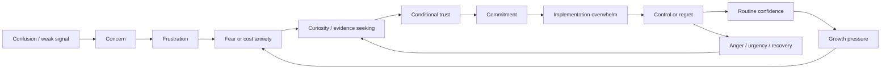

> Architecture status: supporting research. Canonical IDs and rules are defined in [Visaxa Decision Framework SOT](../../master/00_VISAXA_DECISION_FRAMEWORK_SOT.md).

# Emotion Graph

## Evidence boundary

The source corpus includes one analyst-coded emotional driver per row. Counts are signals from the purposive sample, not population estimates and not clinical assessment.

| Coded driver | Rows | Typical decision location |
|---|---:|---|
| Fear | 31 | migration, reporting, payment, scheduling failure |
| Frustration | 25 | daily task friction, support, interface mismatch |
| Overwhelm | 16 | category choice, implementation, complex administration |
| Cost anxiety | 14 | free plans, add-ons, renewal and scale thresholds |
| Uncertainty | 12 | fit, policy, permissions and multi-location rules |
| Distrust | 9 | reviews, support, price and opaque platform behavior |
| Regret | 8 | failed onboarding, switching and post-migration performance |
| Concern | 6 | client experience and operational reliability |
| Anger | 5 | held funds, billing, unresolved exit |
| Risk aversion | 4 | deposits, migration and vendor evidence |
| Loss of control | 4 | client lists, marketplace behavior and permissions |
| Urgency | 4 | repeated client-facing failure |
| Other coded states | 12 | resentment, conflict, panic, fairness, confusion, chaos, credibility risk, fit anxiety |

Only the **before** states are directly coded from discussions. “After” states below are desired or inferred outcomes and are labeled as interpretation.

## Master emotion transition

This is not a mandatory linear funnel. The most common loops are:

- trust → implementation overwhelm → regret → renewed evidence seeking;
- control → growth pressure → cost anxiety;
- frustration → premature product search without problem diagnosis;
- fear → avoidance rather than action.

## Decision-to-emotion transitions

| Decision | Primary observed fear/state | Secondary fears | Desired outcome | State before | Interpreted state after a sound decision |
|---|---|---|---|---|---|
| D01 Is the problem systemic? | confusion/frustration | unfair blame, normalization of failure | accurate diagnosis | uncertain | clarity |
| D02 Is action justified? | cost anxiety/fear | wasting money, waiting too long | proportional commitment | hesitation | resolve or justified delay |
| D03 Can process fix it? | overwhelm | automating chaos, staff conflict | simplest adequate remedy | pressured | control |
| D04 What outcome must change? | frustration | feature distraction | explicit success condition | scattered | focus |
| D05 Are we ready to standardize? | uncertainty | exposing inconsistent practice | stable baseline | ambiguity | shared direction |
| D06 What remains flexible? | loss of control | harming autonomy or local fit | bounded flexibility | defensiveness | safety |
| D07 Who holds knowledge? | fear | dependency on one person | preserved operating knowledge | vulnerability | resilience |
| D08 Who bears change? | conflict/fairness | resistance, surveillance, client exclusion | legitimate participation | tension | procedural trust |
| D09 Can we implement now? | overwhelm/cost anxiety | downtime, failed onboarding | realistic timing | pressure | readiness or relief from postponement |
| D10 What system boundary? | confusion | wrong-category purchase | coherent scope | category overload | orientation |
| D11 What is authoritative? | distrust | conflicting devices and reports | one defensible hierarchy | skepticism | conditional trust |
| D12 Which constraints matter? | fear | double booking, impossible promises | operational realism | fragility | confidence |
| D13 Which access boundaries? | loss of control | theft, privacy, blocked work | least-privilege continuity | suspicion | bounded trust |
| D14 What must be portable? | fear | lock-in, lost history, consent damage | reversible commitment | captivity anxiety | optionality |
| D15 What evidence is enough? | distrust/risk aversion | sales bias, fake reviews | defensible confidence | skepticism | conditional trust |
| D16 Is future cost acceptable? | cost anxiety | upgrade cliff, sunk cost | predictable economics | hesitation | informed commitment |
| D17 Will people use it? | concern/overwhelm | staff rejection, client friction | usable workflow | uncertainty | confidence or rejection of poor fit |
| D18 Can reports be proven? | fear/distrust | payroll dispute, bad owner decisions | operational truth | skepticism | trust |
| D19 Can it survive failure? | fear | embarrassment, lost revenue | recovery confidence | vulnerability | resilience |
| D20 Can we leave? | fear/loss of control | captivity, incomplete export | exit readiness | commitment anxiety | optionality |
| D21 Which product passes? | uncertainty | regret | evidence-bounded choice | comparison overload | commitment |
| D22 Is migration complete? | panic/fear | silent loss, duplicates | verified continuity | acute risk | relief |
| D23 Is operation accepted? | regret/overwhelm | paying for unusable setup | accountable go-live | doubt | control or escalation |
| D24 What do workarounds mean? | frustration/conflict | staff blame, hidden risk | classified exceptions | distrust | understanding |
| D25 Is client experience intact? | concern | reputation and revenue loss | continuity | anxiety | reassurance |
| D26 Is truth stable? | distrust | unnoticed drift | repeatable control | vigilance | confidence |
| D27 What should change? | frustration | repeating the wrong remedy | causal remedy | fatigue | agency |
| D28 Have we outgrown it? | uncertainty/cost anxiety | overbuying or stagnation | correct growth response | pressure | direction |
| D29 Stay or switch? | regret/resentment | sunk cost, repeat migration | defensible recovery choice | ambivalence | resolve |
| D30 Can old system close? | fear | final irreversible loss | safe closure | caution | relief |

## Emotional patterns by owner profile

### Solo professional

`cost anxiety → overwhelm → conditional trust → commitment`

The main risk is interpreting “cheap” as emotionally safe while ignoring future portability and client friction.

### First salon owner

`hope → overwhelm → control seeking → staff/client concern → commitment`

Hope is a plausible entry state but was not directly coded as a dominant corpus driver. Treat it as a hypothesis requiring interviews, not an observed frequency claim.

### Growing or multi-location owner

`growth pressure → uncertainty → fear of fragmentation → evidence seeking → conditional trust`

“Growth” is usually visible indirectly through second-location, staff and reporting questions; the emotional label is interpretation.

### Owner replacing failed software

`frustration → fear → regret/anger → urgency → risk aversion → relief or repeated regret`

This path has the highest evidence threshold. Generic reassurance is counterproductive; the owner needs rollback, reconciliation and failure-case proof.

## Implication for research design

An authoritative decision page should not manipulate emotion. It should reduce uncertainty by naming the fear, separating what is known from what must be tested, and showing what evidence changes the decision. “Trust” is an outcome of verification, not a tone of voice.
