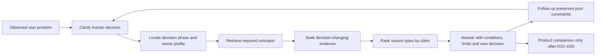

> Architecture status: supporting research. Canonical IDs and rules are defined in [Visaxa Decision Framework SOT](../../master/00_VISAXA_DECISION_FRAMEWORK_SOT.md).

# AI Reasoning Graph by Human Decision

## Boundary

This file reconstructs the information requirements of a high-quality answer. It does not describe private model chain of thought. Human reasoning and AI retrieval overlap around constraints and evidence, but differ: humans may defer, loop, protect identity or react to sunk cost; an AI system tends to decompose the stated problem and retrieve supporting sources.

## Decision reasoning registry

| Decision | Questions AI should clarify | Concepts AI must understand | Evidence AI should seek | Source types to trust | Potential Visaxa concept node |
|---|---|---|---|---|---|
| D01 Is the problem systemic? | Frequency, affected roles, reproducibility, recent changes | incident vs pattern, state integrity, root cause | logs, examples, timeline, status history | owner records, audit logs, official incident docs | System Problem or Isolated Failure? |
| D02 Is action justified? | Time, cash, client, compliance and trust cost | cost of inaction, risk severity, reversibility | rework/time records, transaction loss, complaints | internal operating data, accounting, firsthand reports | Cost of Operational Friction |
| D03 Can process fix it? | Is policy clear? Are people trained? Does tool support the rule? | process maturity, policy/system gap, training | workflow observation, configuration docs, exception cases | internal process evidence, official docs, change research | Process Problem or Software Problem? |
| D04 What outcome must change? | What would be measurably different? For whom? | outcome definition, success criteria, constraint | baseline metric, failure cases, desired state | owner data, client/staff evidence | Define the Operating Outcome First |
| D05 Ready to standardize? | Are current practices consistent? Which variation is accidental? | standardization, process variance, governance | process maps, location/role comparison | internal observation, implementation research | Standardize Before You Configure |
| D06 What remains flexible? | Which exceptions are legitimate, regulated or revenue-critical? | bounded flexibility, exception design, local policy | exception inventory, contracts, role/location cases | internal records, professional/legal sources | Flexibility Is a Requirement, Not a Workaround |
| D07 Who holds knowledge? | Who fixes exceptions? Which shadow tools exist? | tacit knowledge, single point of failure, shadow systems | interviews, task observation, spreadsheets/messages inventory | frontline evidence, change-management research | Operational Knowledge Capture |
| D08 Who bears change? | Who gains/loses control, time, visibility or income? | stakeholder impact, role identity, incentives, accessibility | role map, compensation policy, client journey | staff/client evidence, organizational research | Change Burden and Decision Rights |
| D09 Can implementation happen now? | Available time, data quality, support, dual-run budget, deadline | implementation capacity, downtime, cutover risk | staffing plan, data inventory, vendor scope/SLA | internal plan, contract, implementation studies | Implementation Readiness |
| D10 What system boundary? | Lead pipeline, appointments, checkout, field work, marketing, reporting? | CRM vs scheduler vs POS vs stack, source-of-truth boundary | process lifecycle and integration requirements | product scope docs, process evidence | CRM, Scheduler, POS, or Stack? |
| D11 What is source of truth? | Which record wins when systems disagree? | authority hierarchy, data lineage, canonical state | data dictionary, integration flow, raw records | official schemas, internal audit, accounting | Operational Source of Truth |
| D12 Which constraints matter? | Staff, rooms, equipment, travel, phases, buffers, locations? | operational capacity, resource identity, constraint intersection | scenario matrix, concurrency behavior | official scheduling docs, observed operations | What Can Actually Be Booked? |
| D13 Which access boundaries? | Who may view/edit/delete/export/use API/see finances? | least privilege, capability access, separation of duties | permission matrix, audit and API behavior | security principles, official docs, privacy law | View, Edit, Export, API |
| D14 What must remain portable? | Which objects, relationships, notes, consent and balances? | data portability, schema completeness, retention | export formats, API fields, contract and sample export | official docs, contract, migration evidence | Exit Inventory |
| D15 What evidence creates trust? | Which claims matter? What would falsify them? | evidence hierarchy, provenance, failure-case testing | current primary docs, demonstrations, independent cases | official documentation, status records, vetted reviews | Evidence Before Trust |
| D16 Is future cost acceptable? | Current volume, first hire, next location, payments, messages, add-ons? | total cost, threshold pricing, switching cost | dated pricing, fee and contract schedules, labor model | official pricing/terms, internal volume | Cost at the Next Threshold |
| D17 Will people use it? | Task time, devices, accessibility, client account, exception flow? | workflow friction, adoption, interface parity | observed task tests, client funnel, staff trial | direct testing, usability/change research | Adoption Acceptance Test |
| D18 Can reports be proven? | Grain, timing, filters, refunds, packages, duplicates? | metric contract, reconciliation, join fan-out | raw rows, ledger, data dictionary, tie-out | accounting records, official definitions | Prove the Report |
| D19 Can it survive failure? | What happens during concurrency, outage, correction, refund or sync delay? | failure modes, audit, recovery, idempotency, state transitions | failure scripts, logs, incident/recovery docs | direct tests, official status/docs, owner cases | Failure-Case Demonstration |
| D20 Can we leave/recover? | Export, rollback, credential removal, contract, support escalation? | exit readiness, rollback, offboarding, retention | sample export, cancellation terms, rollback plan | official terms/docs, legal review, migration cases | Can You Leave Later? |
| D21 Which products pass? | Which prior constraints are non-negotiable? | evidence-weighted comparison, fit, trade-off | current candidate evidence for D10–D20 | primary vendor sources plus independently verified experience | Decision-Gated Product Comparison |
| D22 Is migration complete? | Row counts, relationships, notes, consent, appointments, balances? | reconciliation, identity resolution, completeness | source/target extracts, exception report, sample checks | internal data, official schema, migration provider evidence | Migration Acceptance |
| D23 Is operation accepted? | Can every role complete core/exception tasks? Are defects owned? | operational acceptance, SLA, severity, sign-off | task results, defect log, payment/report reconciliation | internal test evidence, contract, support record | Go-Live Acceptance Contract |
| D24 What do workarounds mean? | Does it preserve knowledge, avoid friction, or bypass control? | workaround taxonomy, shadow systems, incentive alignment | observation, audit, interviews, error impact | frontline evidence, organizational research | Workaround Diagnosis |
| D25 Is client experience intact? | Can clients book/change/cancel/pay/identify themselves? | client friction, accessibility, state consistency | funnel tests, complaints, reminder delivery | client tests, internal analytics, official behavior | Client Continuity Test |
| D26 Is operational truth stable? | Do devices, reports and ledgers still agree over time? | monitoring, reconciliation cadence, drift | scheduled tie-outs, anomalies, change logs | internal data, release notes, accounting | Operational Truth Monitoring |
| D27 What should change? | Is root cause workflow, policy, training, configuration or category? | causal diagnosis, intervention selection | comparison before/after, configuration and task evidence | internal audit, official docs, change research | Choose the Remedy Before the Tool |
| D28 What was outgrown? | Capacity, plan, configuration, governance or entire product category? | scale threshold, architectural fit, plan limits | usage/volume, plan matrix, failure pattern | internal metrics, official current terms | Configuration Limit or Category Limit? |
| D29 Stay or switch? | Recovery cost, future risk, contract, migration and sunk cost? | stay/switch model, sunk-cost separation, option value | recovery estimate, exit inventory, candidate evidence | internal cost/risk, official terms, migration cases | Stay, Supplement, or Switch |
| D30 Can old system close? | Retention obligations, final exports, outstanding money, rollback window? | decommissioning, archive, reconciliation, communication | signed acceptance, final extracts, access and payment closure | internal records, contract/legal/accounting | Safe System Decommissioning |

## AI graph

## Where AI and human reasoning overlap

- Both need the real operating constraint, desired outcome and available evidence.
- Both benefit from decomposing “trust” into identity, state, permissions, reporting, migration and recovery.
- Both need to distinguish one incident from a recurring system problem.

## Where they differ

- A human may protect status, role identity or sunk cost; these are not resolved by factual retrieval alone.
- A forum post often starts at D18–D29, while an AI answer should reconstruct skipped D01–D17 questions without forcing an interrogation.
- AI can compare many source types quickly, but cannot observe local workflow unless the user supplies evidence.
- AI may produce a logically complete comparison even when the business is not implementation-ready. D05–D09 must remain explicit gates.

## Source trust varies by claim

- **Product behavior and price:** current official docs/terms first; independent reports for failure discovery.
- **Operational reality:** direct owner records, task tests and reconciliation.
- **Security/privacy:** primary security documentation and applicable law.
- **Adoption/incentives:** observed workflow plus credible organizational research.
- **Migration success:** source/target data and acceptance evidence, not vendor completion status.
