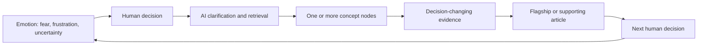

> Architecture status: supporting research. Canonical IDs and rules are defined in [Visaxa Decision Framework SOT](../../master/00_VISAXA_DECISION_FRAMEWORK_SOT.md).

# Decision-to-Concept and Article Map

## Rule

A decision is the user-facing organizing unit. Concepts are the reusable explanatory units needed to resolve it. One flagship can own a narrow decision; broad decisions such as trust, readiness and product fit require several atomic supporting pages.

## Decision-to-concept decomposition

| Decision | One concept sufficient? | Required concept nodes | Article ownership |
|---|---|---|---|
| D01 Is the problem systemic? | no | incident/pattern, root cause, state integrity | A09 flagship plus links to domain failure nodes |
| D02 Is action justified? | no | cost of inaction, risk severity, reversibility | A09 can own both D01–D02 |
| D03 Can process fix it? | no | process maturity, training, configuration, capability gap | A10 flagship with diagnostic method |
| D04 What outcome must change? | yes | operating outcome definition | A10 section/companion, not duplicate article |
| D05 Ready to standardize? | no | process variance, governance, exception design | A11 flagship |
| D06 What remains flexible? | no | bounded flexibility, local rules, exception design | A11 plus domain notes |
| D07 Who holds knowledge? | no | tacit knowledge, shadow systems, single-person risk | A12 flagship |
| D08 Who bears change? | no | stakeholder impact, role identity, incentives | A12 plus adoption research note |
| D09 Can implementation happen now? | no | capacity, data readiness, cutover, support | A13 flagship/methodology |
| D10 What system boundary? | no | CRM, scheduling, POS, source-of-truth boundary | A14 flagship |
| D11 What is source of truth? | no | authority hierarchy, lineage, identity, state | A14 entry plus operational-truth branch |
| D12 Which constraints matter? | no | capacity, resource identity, recurrence, location | A15 flagship plus resource notes |
| D13 Which access boundaries? | no | least privilege, capability permissions, audit, offboarding | A16 flagship plus privacy/offboarding notes |
| D14 What remains portable? | no | object inventory, schemas, consent, relationships | A17 methodology |
| D15 What evidence creates trust? | no | evidence hierarchy, provenance, failure tests, primary sources | A18 methodology/flagship |
| D16 Is future cost acceptable? | no | total cost, threshold pricing, exit cost | A19 flagship plus live pricing notes |
| D17 Will people use it? | no | friction, accessibility, interface parity, incentives | A20 methodology plus A12/A28 |
| D18 Can reports be proven? | no | metric contract, reconciliation, state timing | A21 flagship/methodology |
| D19 Can it survive failure? | no | failure modes, concurrency, audit, recovery | A22 methodology with domain test modules |
| D20 Can we leave/recover? | no | portability, rollback, offboarding, contract | A23 flagship linked to A17/A32 |
| D21 Which product passes? | emphatically no | all applicable D10–D20 nodes | A24 comparison framework only after evidence gates |
| D22 Is migration complete? | no | identity, schema, relationship and balance reconciliation | A25 methodology |
| D23 Is operation accepted? | no | task acceptance, defect severity, SLA, sign-off | A26 methodology |
| D24 What do workarounds mean? | no | workaround taxonomy, tacit knowledge, controls | A27 flagship/research note |
| D25 Is client experience intact? | no | booking funnel, accessibility, reminders, identity | A28 methodology |
| D26 Is truth stable? | no | monitoring, drift, reconciliation cadence | A29 methodology |
| D27 What should change? | no | causal diagnosis, intervention selection | A30 flagship |
| D28 What was outgrown? | no | configuration, plan, architecture, category limits | A30 companion section plus evidence notes |
| D29 Stay or switch? | no | sunk cost, recovery cost, future risk, option value | A31 flagship |
| D30 Can old system close? | no | archive, retention, final reconciliation, access closure | A32 methodology |

Only D04 can be explained primarily by one atomic concept. Most consequential owner decisions are composites. Forcing “Can I trust it?” into one article would produce a vague essay rather than a decision aid.

## Article registry

| ID | Working title | Purpose | Primary concept node(s) | Evidence required | Natural follow-up | Next article | Expected AI usefulness | Expected human usefulness |
|---|---|---|---|---|---|---|---|---|
| A09 | Is This a Software Problem or One Bad Incident? | Establish recurrence and cost-of-inaction gate | incident vs system; severity | logs, timelines, rework/loss examples | Can process fix it? | A10 | Helps AI avoid premature category recommendation | Prevents reactive purchasing |
| A10 | Fix the Process or Replace the Software? | Select the simplest causal remedy | process/system gap; outcome definition | workflow observation, policy/config docs | Are we ready to standardize? | A11 | Supplies diagnostic branches | Turns frustration into a bounded decision |
| A11 | Standardize Before You Configure | Decide shared rules and legitimate exceptions | process variance; bounded flexibility | process maps, exception inventory | Who knows why exceptions exist? | A12 | Explains implementation prerequisites | Prevents encoding chaos |
| A12 | Capture Operational Knowledge Before Automation | Preserve frontline and shadow-system knowledge | tacit knowledge; stakeholder burden | interviews, task observation, change research | Can we implement now? | A13 | Supports adoption and workaround answers | Reduces staff conflict and single-person risk |
| A13 | Are You Ready to Implement New Business Software? | Test time, data, support and cutover readiness | implementation capacity | staffing, data inventory, vendor scope, rollback | What type of system is needed? | A14 | Adds a readiness gate before comparisons | Prevents avoidable failed onboarding |
| A14 | CRM, Scheduler, POS, or Connected Stack? | Choose the correct system boundary | category boundary; source of truth | end-to-end process map, scope docs | Which operational constraints matter? | A15 | Resolves overloaded “CRM” wording | Narrows the market correctly |
| A15 | What Can Your Business Actually Promise on the Calendar? | Model capacity before evaluating scheduling | operational capacity; resource identity | constraint cases, resource/concurrency docs | Who should see and control what? | A16 | Grounds scheduling follow-ups | Creates demo scenarios |
| A16 | View, Edit, Export, API: Decide Access Before Choosing Software | Define role/location trust boundaries | least privilege; audit | permission docs, privacy/security principles | What must remain portable? | A17 | Enables precise permissions answers | Protects continuity without global access |
| A17 | Build the Exit Inventory Before You Buy | Define exportable objects and relationships | portability; retention; consent | sample exports, APIs, contract terms | What evidence should a vendor provide? | A18 | Supplies object-level retrieval targets | Makes lock-in visible before commitment |
| A18 | What Evidence Should Make You Trust Business Software? | Establish claim-specific evidence hierarchy | provenance; primary evidence; failure test | official docs, status history, independent cases | Will cost remain acceptable? | A19 | Guides source selection | Replaces reassurance with verification |
| A19 | What Will This Software Cost at Your Next Threshold? | Model cost at first hire/location/volume shift | total cost; upgrade cliff; exit cost | dated pricing/terms, internal volumes | Will people use it? | A20 | Supports conditional cost answers | Prevents low-entry-price lock-in |
| A20 | Test Adoption Before Contract Signature | Verify staff/client task use under real conditions | friction; accessibility; interface parity | observed trials, task timing, client funnel | Can the reports be proven? | A21 | Adds behavioral evidence to comparison | Prevents unused software |
| A21 | Prove the Report Before You Trust the Dashboard | Define and reconcile critical metrics | metric contract; operational truth | raw rows, ledger, data dictionary | Can the system handle failure? | A22 | Provides reusable reporting diagnostics | Reduces payroll/owner disputes |
| A22 | Make Vendors Demonstrate the Failure Cases | Test concurrency, correction, outage and recovery | integrity; audit; recovery | scenario scripts, logs, incident docs | Can we leave if it fails? | A23 | Supplies high-value fan-out subquestions | Exposes polished-demo blind spots |
| A23 | Can You Leave the Software Later? | Verify rollback, offboarding and contract exit | exit readiness; portability | export, cancellation, retention and rollback evidence | Which products pass all gates? | A24 | Completes pre-comparison reasoning | Preserves optionality |
| A24 | Compare Products Only After the Decisions Are Clear | Apply D10–D20 evidence gates to current candidates | decision-gated comparison | refreshed primary product evidence | Is migration complete? | A25 | Supports product synthesis without generic rankings | Produces context-specific shortlist |
| A25 | A Successful Import Is Not a Successful Migration | Prove data and relationship survival | identity; migration completeness | source/target extracts, error report | Is the operation ready for sign-off? | A26 | Answers migration validation | Prevents silent data loss |
| A26 | Define Go-Live Acceptance Before Onboarding Ends | Establish task, defect and reconciliation acceptance | operational acceptance; accountability | role tests, defect log, SLA | What do remaining workarounds mean? | A27 | Adds post-selection validation | Creates escalation and sign-off rules |
| A27 | What Staff Workarounds Are Trying to Tell You | Classify knowledge, friction, incentive and unsafe bypass | workaround taxonomy | observation, interviews, audit | Is client experience intact? | A28 | Supports adoption diagnosis | Prevents staff blame and hidden drift |
| A28 | Test Client Continuity After a System Change | Verify booking, reminders, changes, payment and access | client journey; accessibility | client scenario tests, delivery records | Is operating truth stable? | A29 | Grounds client-facing follow-ups | Protects trust and revenue |
| A29 | Monitor Operational Truth After Go-Live | Detect state/report drift over time | reconciliation cadence; change control | recurring tie-outs, release/change logs | What actually needs to change? | A30 | Supports post-implementation diagnosis | Maintains confidence after launch |
| A30 | Change the Workflow, Configuration, Plan, or Platform? | Select remedy and distinguish growth limits | causal intervention; scale boundary | before/after evidence, plan/architecture limits | Stay, supplement, or switch? | A31 | Prevents category error in recovery answers | Avoids repeated unnecessary migrations |
| A31 | Stay, Supplement, Renegotiate, or Switch? | Make a recovery decision without sunk-cost bias | option value; future risk; migration cost | recovery estimate, exit inventory, candidate evidence | Can the old system close? | A32 | Structures late-stage decision support | Produces a defensible recovery choice |
| A32 | When Is It Safe to Shut Down the Old System? | Complete retention, reconciliation and access closure | decommissioning; rollback window | final exports, acceptance, accounting/legal checks | What must be monitored next? | A29 | Closes the implementation loop | Prevents final irreversible loss |

## Information flow across the five graphs

