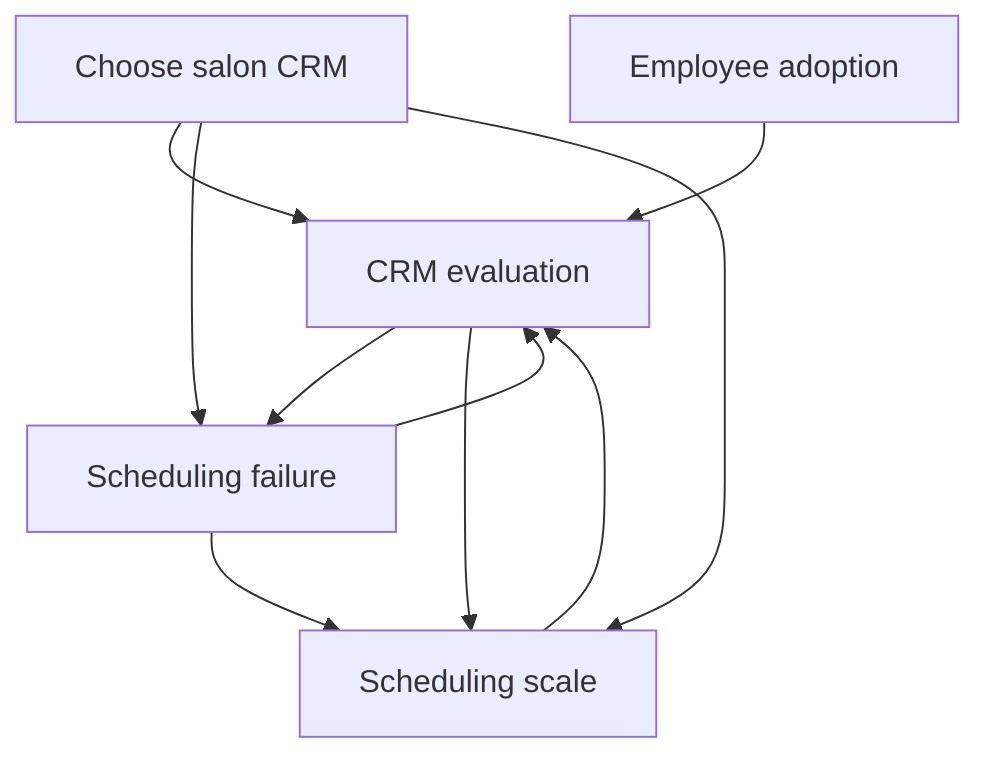

> Architecture status: supporting research. Canonical IDs and rules are defined in [Visaxa Decision Framework SOT](../../master/00_VISAXA_DECISION_FRAMEWORK_SOT.md).

# Existing Visaxa Content Mapping by Human Decision

## Current implementation

Five posts are published. Three files are drafts and are not treated as current coverage. This audit maps what the articles actually help a reader decide; it does not treat titles or planned pages as completed strategy.

## Published article audit

### A01 — How to Evaluate a CRM: What Actually Matters for Service Businesses

- **Decision resolved:** partially D10 (system boundary), D15 (what to evaluate) and D21 (how to compare).
- **Fear reduced:** choosing from a superficial feature matrix and regretting operational mismatch.
- **Emotion addressed:** overwhelm and uncertainty; intended movement toward structured confidence.
- **Concept owned:** workflow fit and operational evaluation.
- **What it does not resolve:** implementation readiness, migration acceptance, permission boundaries, metric proof or exit procedure.
- **Natural next decision:** D12 “Which real constraints must the system represent?” or D14 “What must remain portable?”
- **Future article:** A15 *What Can Your Business Actually Promise on the Calendar?* and A17 *Build the Exit Inventory Before You Buy*.
- **Current termination:** readers are told portability and reporting matter but cannot continue into an object inventory or reconciliation method.

### A02 — Why Scheduling Breaks in Service Businesses (and How to Fix It)

- **Decision resolved:** D01 (recognize a systemic pattern), D03 (system versus staff blame) and partly D12 (operational constraints).
- **Fear reduced:** recurring calendar chaos and unfairly attributing failure to staff.
- **Emotion addressed:** frustration and fear; intended movement toward causal clarity.
- **Concept owned:** scheduling failure as a system-design problem.
- **What it does not resolve:** resource identity, concurrent request tests, appointment/payment states or recovery proof.
- **Natural next decision:** D19 “Can the system survive real exceptions and failure?”
- **Future article:** A22 *Make Vendors Demonstrate the Failure Cases*.
- **Current termination:** the page links to scheduling scale and CRM evaluation, but not to a concrete integrity test.

### A03 — What Actually Breaks First When a Scheduling System Scales

- **Decision resolved:** partly D28 (has the business outgrown the current configuration/category?) and D12 (which constraints emerge at scale?).
- **Fear reduced:** discovering too late that growth changed the operating model.
- **Emotion addressed:** uncertainty and growth-related concern; intended movement toward preparedness.
- **Concept owned:** scheduling scalability and constraint interaction.
- **What it does not resolve:** location hierarchy, shared/local entities, location-scoped permissions or consolidated report proof.
- **Natural next decision:** D12 in a multi-location form, followed by D13 and D18.
- **Future article:** A15 plus a supporting multi-location decision note.
- **Current termination:** it returns readers to generic CRM evaluation instead of a cross-location scenario matrix.

### A04 — How to Choose a Salon CRM Without Regretting It Later

- **Decision resolved:** partly D10, D16, D17, D20 and D21 for a salon-owner profile.
- **Fear reduced:** future regret, hidden operational complexity and choosing only by visible features.
- **Emotion addressed:** fit anxiety, cost anxiety and uncertainty; intended movement toward cautious commitment.
- **Concept owned:** salon-specific decision framing.
- **What it does not resolve:** the evidence threshold for pricing, migration, permissions, reporting and failure recovery.
- **Natural next decision:** D15 “What evidence would make a candidate trustworthy?”
- **Future article:** A18 *What Evidence Should Make You Trust Business Software?*
- **Current termination:** the reader reaches several correct evaluation questions but no dated evidence protocol or product gate.

### A05 — Why Good Employees Stop Using Good Software

- **Decision resolved:** partly D24 (what do workarounds mean?) and D27 (what kind of remedy is needed?).
- **Fear reduced:** that resistance proves employees are lazy or the purchase is automatically a failure.
- **Emotion addressed:** frustration, conflict and distrust; intended movement toward understanding.
- **Concept owned:** software adoption as interaction among workflow, incentives and trust.
- **What it does not resolve:** how to capture operating knowledge, measure task friction, run acceptance tests or redesign decision rights.
- **Natural next decision:** D07 “Who holds essential operating knowledge?” then D17 “Will people use the workflow?”
- **Future article:** A12 *Capture Operational Knowledge Before Automation* followed by A20 *Test Adoption Before Contract Signature*.
- **Current termination:** it links only to CRM evaluation, sending a post-implementation behavior problem back to a pre-purchase generic framework.

## Drafts: potential role, not current coverage

| ID | Draft | Potential decision role | Current limitation |
|---|---|---|---|
| A06 | `owner-checklist` | D09, D22, D23 | Too broad; should be split or rebuilt around implementation and migration acceptance |
| A07 | `financial-privacy-safe-mode` | narrow child of D13 | Shared-screen PIN does not resolve view/edit/export/API/offboarding decisions |
| A08 | `square-fresha-mindbody` | D21 | Product comparison appears before a documented current-evidence protocol |

## Current article graph

The graph is cyclic around evaluation/scheduling but lacks forward decisions after evaluation, implementation and adoption.

## Decision paths that currently terminate

| Existing entry | Missing next decision | Recommended continuation |
|---|---|---|
| CRM evaluation | D14 portability | A17 → A23 |
| CRM evaluation | D18 report proof | A21 |
| Salon choice | D15 evidence threshold | A18 |
| Salon choice | D16 threshold cost | A19 |
| Scheduling failure | D19 failure demonstration | A22 |
| Scheduling scale | D13 multi-location access boundaries | A16 plus multi-location support note |
| Employee adoption | D07 knowledge capture | A12 |
| Employee adoption | D24 workaround classification | A27 |
| Any pre-purchase article | D22 migration acceptance | A25 |
| Any implementation article | D23 go-live acceptance | A26 |
| Any active-use path | D26 operational truth monitoring | A29 |
| Any failure/recovery path | D29 stay or switch | A31 |

## Contradiction

Current strategy says feature checklists are insufficient, but the site does not yet offer the evidence tests that replace them. Without A17–A26, the reader is encouraged to think operationally but still has to leave Visaxa to determine how to prove the decision.
