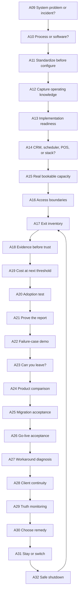

> Architecture status: supporting research. Canonical IDs and rules are defined in [Visaxa Decision Framework SOT](../../master/00_VISAXA_DECISION_FRAMEWORK_SOT.md).

# Next Decision Branches

These branches are organized by human decisions, not product categories. Supporting concept pages may remain low-emphasis; flagship pages should be visible entry points.

## Branch 1 — Should I act, and what should change?

- **Entry state:** recurring friction, confusion or an isolated crisis.
- **Decision chain:** D01 systemic? → D02 worth acting? → D03 process or software? → D04 required outcome.
- **Owner profiles:** all; especially first-time and frustrated owners.
- **Articles:** A09, A10.
- **Evidence requirement:** incident timelines, task/rework cost, policy/configuration distinctions.
- **Current coverage:** scheduling-failure article covers this only for one domain.
- **Next decision:** D05 readiness to standardize.
- **Reason for priority:** prevents every operational complaint from becoming a product search.
- **AI role:** reconstruct upstream diagnosis when the user begins with “best software.”
- **Product comparison:** prohibited at this stage; the system category is not yet known.

## Branch 2 — Are we ready to change how the business works?

- **Entry state:** owner accepts that current operation must change.
- **Decision chain:** D05 standardize? → D06 preserve flexibility? → D07 capture knowledge? → D08 share decision burden? → D09 implementation capacity?
- **Owner profiles:** first salon, growing salon, multi-location, failed implementation recovery.
- **Articles:** A11, A12, A13.
- **Evidence requirement:** process map, exception inventory, stakeholder/role map, data and cutover inventory.
- **Current coverage:** employee-adoption article is a partial late-stage entry but does not provide readiness tests.
- **Next decision:** D10 choose system boundary.
- **Reason for priority:** implementation failures in C04, G209, T09, TR10 and SA09 show that selecting a product does not create implementation capacity.
- **AI role:** detect when the business needs process clarification rather than a recommendation.
- **Product comparison:** only after D09 is passed.

## Branch 3 — What must be true before I compare products?

- **Entry state:** business is ready to formalize requirements.
- **Decision chain:** D10 system boundary → D11 source of truth → D12 real constraints → D13 access boundaries → D14 portability.
- **Owner profiles:** all, with different constraint weights.
- **Articles:** A14, A15, A16, A17.
- **Evidence requirement:** end-to-end service lifecycle, resource scenarios, permission matrix, object-level exit inventory.
- **Current coverage:** CRM evaluation and salon-choice pages begin D10; scheduling pages partially support D12.
- **Next decision:** D15 evidence standard.
- **Reason for priority:** this is the missing bridge between generic evaluation and defensible comparison.
- **AI role:** preserve profile-specific constraints through follow-ups.
- **Product comparison:** still deferred; requirements are now clear, evidence quality is not.

## Branch 4 — What evidence earns commitment?

- **Entry state:** shortlist or vendor claims exist.
- **Decision chain:** D15 trust evidence → D16 future cost → D17 adoption → D18 report proof → D19 failure survival → D20 exit/recovery → D21 candidate comparison.
- **Owner profiles:** all; highest importance for failed-system replacement and multi-location owners.
- **Articles:** A18–A24.
- **Evidence requirement:** current primary product docs, dated terms, task trials, reconciliation, failure demonstrations and exports.
- **Current coverage:** the evaluation and salon-choice articles raise parts of these questions but do not supply the protocols.
- **Next decision:** D22 migration acceptance.
- **Reason for priority:** this branch is where trust becomes conditional and product comparison finally becomes legitimate.
- **AI role:** fan out across claim-specific source types and explain uncertainty.
- **Product comparison:** A24 is the terminal article in the pre-purchase path, not the entry page.

## Branch 5 — Did implementation actually work?

- **Entry state:** a product has been selected and configuration/migration are underway.
- **Decision chain:** D22 migration complete? → D23 operationally accepted? → D24 understand workarounds → D25 client continuity → D26 stable truth.
- **Owner profiles:** migrators, first implementation and recovery owners.
- **Articles:** A25–A29.
- **Evidence requirement:** source/target reconciliation, role task tests, defect ownership, client scenarios and monitoring cadence.
- **Current coverage:** owner checklist draft is adjacent but not sufficient.
- **Next decision:** D27 select the correct remedy.
- **Reason for priority:** imported records and onboarding status are repeatedly mistaken for usable operations.
- **AI role:** help the user diagnose and verify, not simply repeat configuration instructions.
- **Product comparison:** absent unless acceptance fails and the path enters Branch 6.

## Branch 6 — Recover, scale or leave

- **Entry state:** active operation is drifting, expensive or no longer fits.
- **Decision chain:** D27 what should change? → D28 what was outgrown? → D29 stay/supplement/renegotiate/switch? → D30 safe shutdown → loop to D14/D15 if switching.
- **Owner profiles:** growing, multi-location and failed-system replacement.
- **Articles:** A30–A32, linking back to A17, A18 and A25.
- **Evidence requirement:** root-cause evidence, current plan/architecture boundaries, recovery estimate, migration inventory and final reconciliation.
- **Current coverage:** scheduling-scale and employee-adoption articles help diagnose part of D27–D28 but offer no recovery branch.
- **Next decision:** if staying, return to D23; if switching, return to D14 rather than jumping directly to D21.
- **Reason for priority:** prevents repeated migration caused by unresolved process or evidence problems.
- **AI role:** distinguish configuration, plan, workflow and category failure.
- **Product comparison:** only after the exit inventory and evidence standard are rebuilt.

## Priority order

| Priority | Branch | Why now |
|---:|---|---|
| 1 | What must be true before product comparison? | Strongest bridge from existing evaluation/scheduling content and largest missing decision layer |
| 2 | Did implementation actually work? | Highest-consequence evidence gap; supports migration and operational acceptance |
| 3 | What evidence earns commitment? | Converts broad evaluation advice into defensible product comparison |
| 4 | Are we ready to change? | Essential for adoption and failed onboarding, but needs behavioral evidence |
| 5 | Recover, scale or leave | Valuable once exit and acceptance methods exist |
| 6 | Should I act? | Foundational, but existing scheduling/adoption pages partially cover the diagnostic stance |

## Article graph

This diagram is a canonical reading order, not a requirement that every reader consume 24 articles. AI-assisted navigation can enter at any decision, retrieve the necessary upstream concepts, and propose the next decision without forcing a linear journey.
